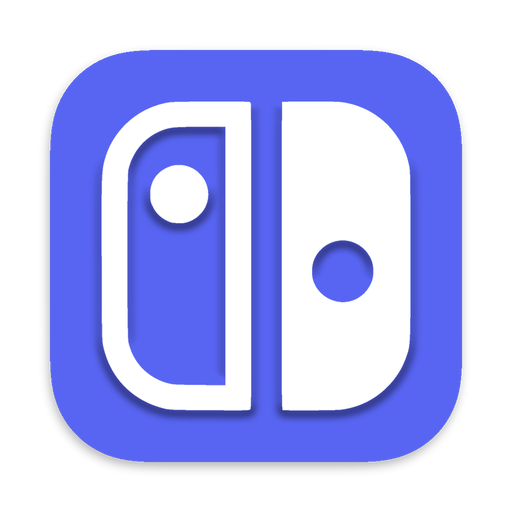
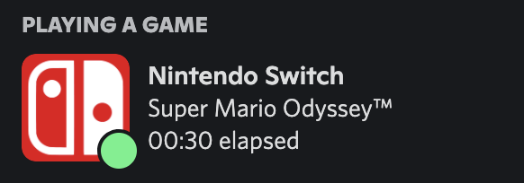
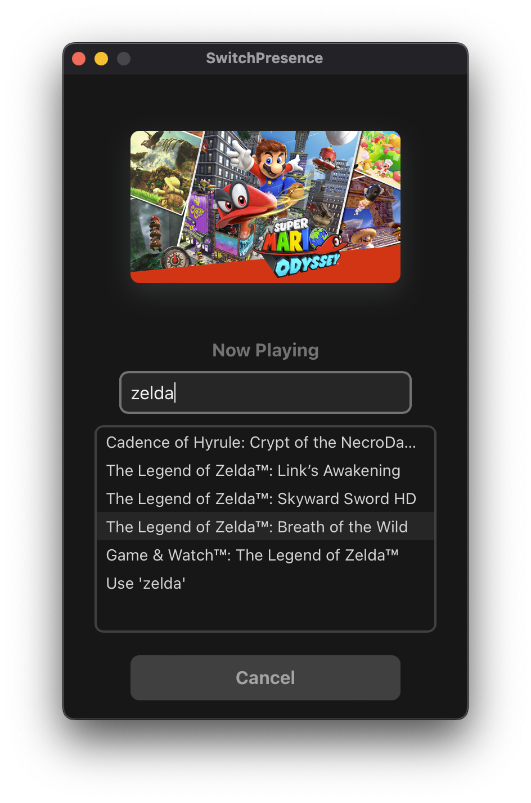

    

<h1 align="center">
    SwitchPresence
</h1>

    Discord Rich Presence for Nintendo Switch games

---

    

    

**SwitchPresence** is a cross-platform desktop application that allows you to display Nintendo Switch games as your current activity on Discord. Nintendo provides no service that allows us to get your current game automatically, so you'll have to set your game manually. Luckily, it's super easy to do, and the app is equipped with thousands of games from the eShop that you can select from.

    

Can't find your game? The last search result will always allow you to enter a custom game. Feel free to create an [issue](https://github.com/dilanx/switchpresence/issues) with the name of the missing game and we'll do our best to have it updated within 24 hours!

---

## Download

| OS      | Download                                                                                                                 |
| ------- | ------------------------------------------------------------------------------------------------------------------------ |
| macOS   | [SwitchPresence.app.tar.gz](https://github.com/dilanx/switchpresence/releases/download/v1.0.0/SwitchPresence.app.tar.gz) |
| Windows | [SwitchPresence.msi](https://github.com/dilanx/switchpresence/releases/download/v1.0.0/SwitchPresence.msi)               |
| Linux   | [SwitchPresence.AppImage](https://github.com/dilanx/switchpresence/releases/download/v1.0.0/SwitchPresence.AppImage)     |
|         | [View all options...](https://github.com/dilanx/switchpresence/releases)                                                 |

The OS-specific downloads are for the latest version of SwitchPresence: **1.0.0**

You can view all options to view alternative download files for the latest and past versions.

The macOS application is code signed, but the others are not. I'm a registered developer with Apple but a Windows signing certificate is apparently about $300 a year so nope I'm good. Although the software is completely safe to use, you may encounter a prompt saying that the software is not signed by a known developer, with a button that says "Don't run". Press "More info" and "Run anyway".

## Troubleshooting

If SwitchPresence does not start, **make sure Discord is open**. The first thing the app does is try to connect to your Discord client, and will automatically shut down if it's unable to.

If you encounter any problems, please [create an issue](https://github.com/dilanx/switchpresence/issues)!
