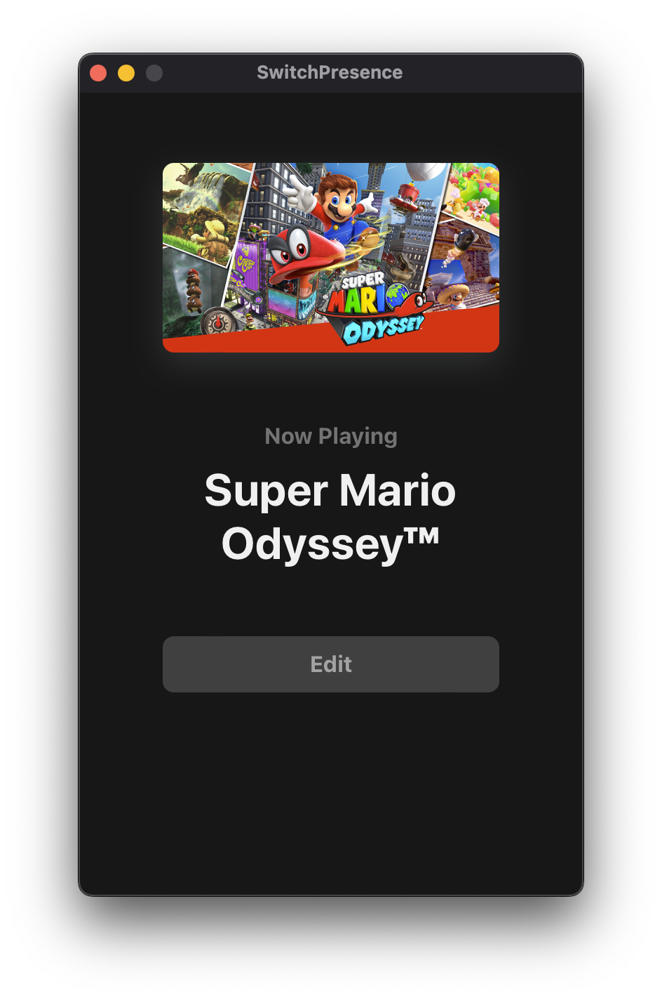

    

<h1 align="center">
    SwitchPresence
</h1>

    Discord Rich Presence for Nintendo Switch games

---

    

    

**SwitchPresence** is a cross-platform desktop application that allows you to display Nintendo Switch games as your current activity on Discord. Nintendo provides no service that allows us to get your current game automatically, so you'll have to set your game manually. Luckily, it's super easy to do, and the app is equipped with thousands of games from the eShop that you can select from.

    

Can't find your game? The last search result will always allow you to enter a custom game. Feel free to create an [issue](https://github.com/dilanx/switchpresence/issues) with the name of the missing game and we'll do our best to have it updated within 24 hours!

---

## Download

| OS      | Download                  |
| ------- | ------------------------- |
| macOS   | SwitchPresence.app.tar.gz |
| Windows | SwitchPresence.msi        |
| Linux   | SwitchPresence.AppImage   |
|         | View all options...       |
